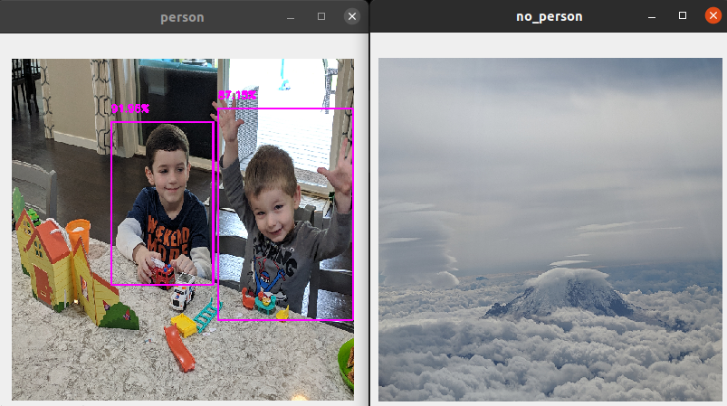

People Picture Sort
===================

Super simple Python script that detects and copies images with people to one folder and remaining pictures with no people present to a different folder

I have many thousands of unsorted images on my mobile phone and needed to seperate all the images containing people (likely my family) from random junk.  

This script is less than 100 lines of Python that implements a "person" detector using Pytorch with a pre-trained RetinaNet object detector model to sort through all my photos.

Works like a champ! :)

**Screenshot:**

Required Packages
-----------------
- PyTorch from https://pytorch.org
- OpenCV

Run
-------
$ python3 people-pic-sort

